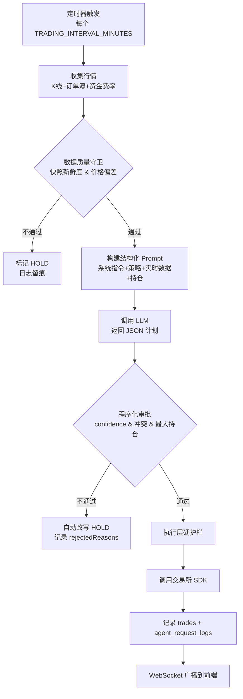

# Q4AI · 加密货币 AI 智能交易平台

<div align="center">

[](https://voltagent.dev)
[](https://openrouter.ai)
[](https://www.typescriptlang.org)
[](https://nodejs.org)
[](./LICENSE)

**[English](./README_EN.md) · [简体中文](./README_ZH.md) · [日本語](./README_JA.md)**

</div>

## ✨ 这是什么

**Q4AI** 是一个新一代加密货币 **AI 智能交易平台**。它把多个交易所账户的真实行情（K 线、订单簿、资金费率、新闻）、当前持仓与可用工具，统一打包成结构化上下文发送给大语言模型，让 AI **自主决策开仓 / 平仓 / 持仓**，再由程序化执行层把关后调用真实下单接口。

平台还附带一个**实时 Web 监控界面**，可以查看账户状态、交易日志、AI 决策详情与盈亏曲线，并支持手动下单、必要时人工干预。

> 🎯 核心理念：**让 AI 真正成为交易员**，而不是写死的指标触发器。

---

## 🖥️ 界面预览

### 1. 实时交易 Dashboard（多交易对 + AI 决策流）


*左侧实时报价滚动 · 中间 K 线 + 标记交易 · 右侧账户统计 + AI 决策流*

### 2. 决策日志列表（每次 AI 调用的输入 / 输出 / 耗时）


*按时间倒序展示每次 AI 请求，可点击查看完整上下文*

### 3. 单次决策详情（系统指令 / 提示词 / AI 输出 / 审批结果）


*每一次「AI 思考」都被完整留痕，可审计、可复盘*

### 4. 策略编辑器（开仓逻辑 / 出场逻辑 / 风险参数）


*用自然语言写策略，平台自动注入参数（杠杆、止损、回撤阈值…）*

---

## 🚀 核心能力

### 🤖 AI 自主决策
- **多模型支持**：DeepSeek V3.2 / GLM-4.6 / Claude 4.5 / GPT-5 / Gemini Pro 2.5 / Kimi
- **OpenAI 兼容 API**：可接入 OpenRouter、OpenAI、自部署推理服务
- **多账户并行**：每个账户独立 Agent、独立策略、独立 Prompt
- **多周期聚合**：1m / 5m / 15m / 1H / 4H / 1D 技术指标统一进 Prompt

### 🛡️ 多层风控
- **数据质量守卫**：快照新鲜度 + 价格偏差 + 指标完整性自动检测
- **结构化决策输出**：AI 必须输出 JSON（confidence / actions / hold reason）
- **程序化审批**：置信度阈值、方向冲突检测、最大持仓数
- **执行层硬护栏**：极端止损 / 账户止损 / 止盈 / 回撤分档（预警 / 暂停 / 强平）

### 📈 真实交易所对接
- **多交易所统一接口**：OKX、Binance、Bitget、Gate.io（永续合约）
- **同一份代码即可跑模拟盘或实盘**，自动切换
- **手动交易面板**：Market / Limit 订单，USDT 面值 / Coin 数量两种模式

### 🌐 实时监控 + 干预
- **Web Dashboard**（默认端口 `3888`）：实时账户 / 持仓 / AI 决策流
- **WebSocket 推送**：状态、日志、价格秒级刷新
- **多语言 UI**：中文 / English / 日本語
- **访客 / 已登录双模式**：未登录只展示 Dashboard，已登录解锁策略编辑 + 手动交易

### 📦 生产级部署
- **PM2 进程管理**、**Docker / docker-compose** 一键启动
- **多平台打包**：macOS DMG、Linux DEB、Windows EXE（bytenode 编译）
- **数据库自动迁移**：LibSQL (SQLite) 持久化所有交易 + AI 决策日志

---

## 🏗️ 架构一览

```
┌────────────────────────────────────────────────────────────────────┐
│                  Browser  (Trading Dashboard)                      │
│       Chart.js / Lightweight Charts · WebSocket · i18n            │
└──────────────────────────┬─────────────────────────────────────────┘
                           │  HTTP / WS
┌──────────────────────────┴─────────────────────────────────────────┐
│                    Hono API Server (port 3888)                     │
│   REST:  /api/logs · /api/decision-requests · /api/trading/manual │
│   WS:    /api/ws  → 状态/日志/价格实时推送                          │
└──┬──────────────────────────────────┬──────────────────────────────┘
   │                                  │
┌──┴──────────────┐         ┌────────┴─────────────────────────────┐
│ Trading Loop    │         │  VoltAgent (Per-Instance Agent)       │
│  (node-cron)    │ ──────► │  ├─ 只读工具：行情 / 账户 / 持仓      │
│  - 调度         │  Prompt │  ├─ 结构化 JSON 输出                  │
│  - 全局锁       │         │  └─ 由 Scheduler 程序化执行           │
└─────────────────┘         └────────┬─────────────────────────────┘
                                     │  Programmatic Approval
                              ┌──────┴──────────────────────────────┐
                              │  Execution Layer (Guard Rails)       │
                              │  ├─ 快照新鲜度校验                   │
                              │  ├─ 价格偏差拦截                     │
                              │  ├─ 风控阈值校验                     │
                              │  └─ 调用交易所 SDK                   │
                              └──────┬──────────────────────────────┘
                                     │
              ┌──────────────────────┼─────────────────────┐
              ▼                      ▼                     ▼
       ┌─────────────┐         ┌────────────┐         ┌────────────┐
       │   OKX       │         │  Binance   │         │  Gate.io   │
       │  (实盘/模拟)│         │  Bitget    │         │            │
       └─────────────┘         └────────────┘         └────────────┘

              ┌─────────────────────────────────────────────────┐
              │   LibSQL (SQLite) · trades · positions          │
              │   agent_request_logs · account_history          │
              └─────────────────────────────────────────────────┘
```

### 技术栈

| 层 | 技术 |
| --- | --- |
| AI Agent 编排 | [VoltAgent](https://voltagent.dev) + AI SDK |
| 大模型接入 | OpenAI 兼容 API（DeepSeek / GLM / Claude / GPT / Gemini / Kimi） |
| HTTP / WS | Hono |
| 数据库 | LibSQL (SQLite) |
| 行情 / 交易 | OKX V5 SDK · Binance · Bitget · Gate.io |
| 前端 | 原生 HTML / CSS / JS（无构建）· Chart.js · Lightweight Charts · Marked |
| 多语言 | 自研 i18n 框架（zh / en / ja） |
| 部署 | PM2 · Docker · bytenode EXE · DMG / DEB 打包 |

---

## ⚡ 快速开始

### 1. 环境要求
- Node.js **>= 20.19.0**
- npm / pnpm 任选
- Git

### 2. 克隆与安装

```bash
git clone https://github.com/q4ai/x-nof1.git
cd x-nof1
npm install
```

### 3. 配置环境变量

复制 `.env.example` 为 `.env`，填写：

```env
# 服务端口（默认 3888）
PORT=3888

# OKX / Binance / Bitget / Gate.io 任选其一，先用模拟盘
OKX_API_KEY=...
OKX_SECRET=...
OKX_PASSPHRASE=...
OKX_SIMULATED=1   # 1=模拟盘 0=实盘

# AI 模型（OpenAI 兼容）
OPENAI_API_KEY=sk-...
OPENAI_BASE_URL=https://api.openrouter.ai/v1
OPENAI_MODEL=deepseek-chat
```

### 4. 初始化数据库 & 启动

```bash
npm run db:init
npm run dev      # 开发模式（ts-node 热更新）
# 或
npm run build && npm run start   # 生产模式
```

打开 [http://localhost:3888/](http://localhost:3888/) 即可看到 Dashboard。

---

## 📂 项目结构

```
src/
├── index.ts                    # 入口（initConfig → loadRiskParams → initTradingSystem）
├── agents/tradingAgent.ts      # VoltAgent 实例：构建上下文 + 解析 LLM 输出
├── api/routes.ts               # Hono 路由：/api/logs · /api/decision-requests …
├── config/
│   ├── riskParams.new.ts       # 动态配置（DB 优先，.env 回退）
│   ├── exchange.ts             # 交易所配置
│   └── promptDefaults.ts
├── database/                   # LibSQL 持久化 + 迁移脚本
├── scheduler/
│   ├── tradingLoop.ts          # node-cron 主循环
│   └── instanceExecutor.ts     # 单实例：收集行情 → AI 决策 → 审批 → 执行
├── services/
│   ├── okxClient.ts            # OKX V5 单例（自动切换模拟 / 实盘）
│   ├── multiTimeframeAnalysis.ts
│   └── websocketService.ts     # 前端广播（状态/日志/价格）
├── strategies/                 # 策略 JSON 加载
├── tools/trading/
│   ├── marketData.ts           # K 线 / 订单簿 / 资金费率（运行时交易对校验）
│   ├── accountManagement.ts    # 余额 / 持仓查询
│   └── tradeExecution.ts       # 开仓 / 平仓（含快照新鲜度 + 价格偏差拦截）
├── prompts/                    # 多语言提示词模板（zh / en / ja）
├── language/                   # UI 多语言字典
└── utils/loggerUtils.ts        # 日志（关键路径必打点）

public/                         # 前端（无构建）
├── index.html                  # 主监控页
├── login.html / install.html   # 鉴权 + 安装向导
├── scripts.js / app.js / csrf.js
├── styles.css / style.css
└── static/icons/

data/strategies/                # 用户策略 JSON（不入 git）
├── AI自主策略.json
├── 波段趨勢.json
├── 超短线DCA.json
├── 稳健策略.json
└── gate激进策略.json

docs/                           # 文档 + 截图
db/                             # LibSQL 数据库（不入 git）
```

---

## 🔄 AI 决策流程



每次 LLM 调用都生成 3 段摘要：
- **`responseSummary`**：AI 原始输出（带 JSON + 自由文本）
- **`decisionSummary`**：计划动作（plan summary / risk / plannedActions）
- **`approvalSummary`**：审批结果（approved / executed / rejectedReasons / holdReasons）

前端可在「决策详情」弹窗里**逐字审阅** AI 当时的输入、思考和执行结果。

---

## 🧰 命令速查

| 命令 | 用途 |
| --- | --- |
| `npm run dev` | 开发模式（前端 + 后端，热更新） |
| `npm run build` | 编译 TypeScript |
| `npm run start` | 生产模式 |
| `npm run trading:start` | 只跑交易循环（不开前端） |
| `npm run db:init` | 初始化数据库 |
| `npm run db:reset` | **重置数据库**（清空所有交易） |
| `npm run lint` / `lint:fix` | Biome 代码检查 / 自动修复 |
| `npm run typecheck` | TypeScript 类型检查 |
| `npm run close-and-reset.sh` | 平仓 + 重置 + 重启（一键回滚） |

打包发布：
```bash
# macOS DMG
./compile/compile_dmg.sh

# Linux DEB
./compile/compile_deb.sh

# Windows EXE（bytenode 加密）
./compile/compile_exe_bytenode.sh
```

---

## 🔐 安全与隐私

- **API 密钥**：仅保存在 `.env`（已加入 `.gitignore`），数据库里不会落盘明文
- **后台入口**：首次启动随机生成 `adminPath`（写入 `/.q4ai`，不入 git）
- **CSRF**：所有写操作需要 CSRF Token
- **多账户隔离**：每个账户走独立 Agent + 独立上下文，互不干扰
- **策略隔离**：策略 JSON 入 git 时**不含真实账户绑定**

⚠️ **实盘风险提示**：AI 决策不等于稳定盈利。强烈建议先在模拟盘跑 1–2 周后再考虑实盘，并自行设置合理的极端止损和账户止损。

---

## 🤝 贡献

欢迎 PR！请遵循：
- 提交前跑 `npm run typecheck` 和 `npm run lint:fix`
- 注释、提交信息、Issue 均使用**中文**
- 数据库 schema 变更必须同步更新 `src/database/schema.ts` 和迁移脚本

---

## 📜 License

[AGPL-3.0](./LICENSE) — 你可以自由使用 / 修改 / 分发，但**衍生作品必须同样开源**。

---

<div align="center">

如果这个项目对你有帮助，欢迎点 ⭐ Star！

**[GitHub 仓库](https://github.com/q4ai/x-nof1) · [反馈 Issue](https://github.com/q4ai/x-nof1/issues)**

</div>
